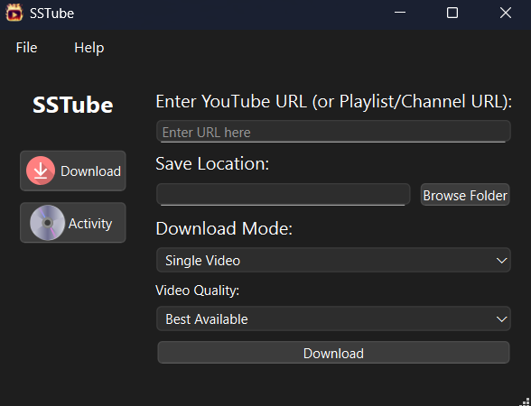

# Youtube‑Media‑Downloader v2.3.0

[](#) [](LICENSE)

<p align="center">
  
</p>

**Youtube‑Media‑Downloader** is an open‑source YouTube downloader built with **PyQt6** and **yt‑dlp**, now tuned for lightning‑fast performance, a sleeker UI, and rock‑solid stability.

---

## What’s New in 2.3.0

### 🚀 Performance & Responsiveness  
- **Blazing‑fast startup**  
  - Lazy‑load icons off the main thread to avoid blocking
  - Disabled unnecessary UI updates during initialization
- **Optimized rendering**  
  - Fixed sidebar width and trimmed widget margins for smoother layout
  - Batched log panel redraws at 100 ms intervals for snappier activity scrolling

### 🎨 Refined User Interface  
- **Virtual‑scroll pickers** for channel/playlist dialogs—no lag, even on thousands of items
- **Streamlined controls**: only relevant download modes and quality options are shown
- **Async icon loading** prevents UI freezes when scaling large images

### 🔧 Under‑the‑Hood Enhancements  
- **Multithreaded downloads** via `QThread`: UI remains responsive under heavy I/O
- **Manual updater** for `yt‑dlp`: checks on demand, with atomic replace and permissions set cleanly

### 🐞 Bug Fixes & Polish  
- Resolved freezes when toggling between **Download** and **Activity** pages 
- Improved fallback browser detection on Windows 
- Enhanced error dialogs with actionable tips for common `yt‑dlp` failures

---

## Features

- **Automatic yt‑dlp Updater** (manual‐trigger mode)  
- **Multiple Download Modes**: single video/MP3, playlists, channels (videos & shorts)  
- **Cookie‑based Authentication** via `cookies.txt` export  
- **Modern PyQt6 Interface** with sidebar navigation and real‑time logs  
- **Flexible Quality Selection** (Best Available, 8K, 4K, 1080p, 320 kbps MP3, etc.)  
- **Cross‑Platform** (Windows/macOS/Linux; ffmpeg required for non‑Windows)

---

## Folder Structure

```

Youtube-Media-Downloader/
├── src/
│   ├── main.py                       # Main PyQt6 application
│   ├── assets/                       # GUI icons & images
│   │   └── video-favicon.png
│   └── bin/                          # Bundled ffmpeg & yt-dlp
│       ├── ffmpeg.exe
│       └── yt-dlp.exe
├── screenshots/                      # GUI screenshots
├── requirements.txt                  # Python dependencies
├── LICENSE
├── .gitignore
└── README.md

````

---

## Requirements

- **Python 3.8+**  
- **ffmpeg** (bundled on Windows; install separately on macOS/Linux)  
- **PyQt6**  
- **yt‑dlp** (managed automatically)  

```bash
pip install -r requirements.txt
````

---

## Installation

1. **Clone the repo**

   ```bash
   git clone https://github.com/UKR-PROJECTS/Youtube-Media-Downloader.git
   cd Youtube-Media-Downloader
   ```

2. **Create & activate a virtual environment** (optional)

   ```bash
   python -m venv venv
   source venv/bin/activate    # Windows: venv\Scripts\activate
   ```

3. **Install dependencies**

   ```bash
   pip install -r requirements.txt
   ```

4. **Verify** `ffmpeg` & `yt-dlp` exist in `src/bin/`.

---

## Usage

1. **Launch the app**

   ```bash
   python src/Youtube-Media-Downloader.py
   ```

2. **(Optional) Check for yt‑dlp updates**
   From **Help > Check for yt‑dlp Update**.

3. **Authenticate with cookies**
   **File > Login**, select your browser and exported `cookies.txt`, then log in via the opened YouTube page.

4. **Download content**

   * Enter a URL (video/playlist/channel/shorts)
   * Choose **Save Location**, **Download Mode**, and **Quality**
   * Click **Download** and monitor progress in **Activity**.

---

## Screenshots

<p align="center">
  
</p>

---

## Building a Standalone Executable

```bash
pyinstaller \
  --onefile --windowed \
  --icon "src/favicon.ico" \
  --add-data "src/assets;assets" \
  --add-data "src/bin;bin" \
  src/main.py
```

Generates `dist/Youtube-Media-Downloader.exe` (or equivalent).

---

## Contributing

1. Fork the repo
2. Create a branch (`git checkout -b feature/xyz`)
3. Commit your changes with clear messages
4. Push & open a Pull Request

Please open an issue first for major enhancements.

---

## License

MIT © UKR‑PROJECTS. See [LICENSE](LICENSE) for details.

---

## Acknowledgments

* **yt‑dlp** for the download engine
* **PyQt6** for the GUI framework
* **ffmpeg** for media processing
