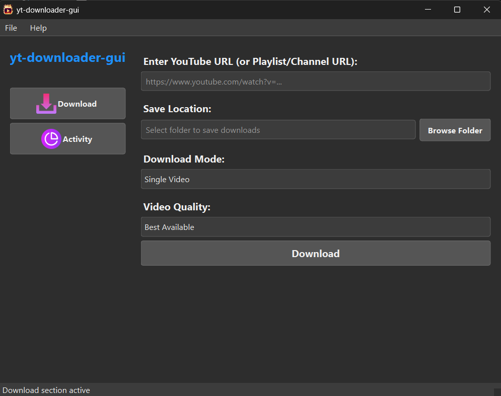

# Youtube‑Media‑Downloader v2.3.1

[](LICENSE) [](#) [](#)

<p align="center">
  
</p>

**Youtube‑Media‑Downloader** is a powerful, open‑source desktop application built with PyQt6 and yt-dlp that lets you download single videos, playlists, channels (videos & shorts), or just MP3 audio—seamlessly and reliably.

---

## 🆕 What’s New in v2.3.1

- **Performance & Responsiveness**
  - Blazing‑fast startup: disabled unnecessary UI updates and lazy‑load icons.
  - Optimized rendering: reduced layout margins, fixed sidebar width.
  - Smooth logging: batched log updates, capped activity log at 1,000 lines.
- **Refined User Interface**
  - Virtual‑scroll dialogs for large playlists/channels.
  - “Select All” / “Deselect All” controls with no flicker.
  - Streamlined controls and intelligent icon scaling.
- **Under‑the‑Hood Enhancements**
  - Multithreaded downloads via `QThread`, keeping UI responsive.
  - Cleaner updater flow: manual yt-dlp checks, atomic replacement.
- **Bug Fixes & Polish**
  - Fixed occasional freezes when switching pages.
  - Corrected Windows browser detection for cookies.
  - Improved error dialogs for common yt-dlp failures.

---

## ⭐ Features

- **Automatic yt‑dlp Updater**  
  Checks GitHub for new yt-dlp releases and replaces your local binary automatically.
- **Multiple Download Modes**  
  - Single Video / MP3  
  - Playlist Video / Playlist MP3  
  - Channel Videos / Channel MP3  
  - Channel Shorts / Shorts MP3
- **Cookie‑Based Login**  
  Import YouTube cookies via “Get cookies.txt Locally” extension for authenticated downloads.
- **Modern PyQt6 GUI**  
  Intuitive sidebar, real‑time status, and scrolling activity log.
- **Flexible Quality Options**  
  Choose best‑available or specific resolutions (8K, 4K, 1080p, etc.); MP3 defaults to 320 kbps.
- **Lightweight & Cross‑Platform**  
  Single‑file app plus assets; runs on Windows, macOS, and Linux (ffmpeg required).

---

## 📁 Folder Structure

```
Youtube-Media-Downloader/
├── src/
│    ├── main.py
│    ├── favicon.ico
│    ├── assets/
│    │    ├── download.png
│    │    ├── activity.png
│    │    └── video-favicon.png
│    └── bin/
│         ├── ffmpeg.exe
│         └── yt-dlp.exe
├── LICENSE
├── README.md
├── requirements.txt
├── .gitignore
└── screenshots/
      └── screenshot.png
````

---

## 📦 Requirements

- Python 3.8+  
- PyQt6  
- ffmpeg (bundled on Windows in `bin/ffmpeg.exe`; install separately on macOS/Linux)  
- yt-dlp (managed by the updater)

```bash
pip install -r requirements.txt
````

---

## 🚀 Installation

1. **Clone the repo:**

   ```bash
   git clone https://github.com/UKR-PROJECTS/yt-dlp-gui.git
   cd yt-dlp-gui
   ```
2. **(Optional) Create & activate a virtual environment:**

   ```bash
   python -m venv venv
   source venv/bin/activate   # Windows: venv\Scripts\activate
   ```
3. **Install dependencies:**

   ```bash
   pip install -r requirements.txt
   ```
4. **Verify executables:**
   Ensure `bin/ffmpeg.exe` and `bin/yt-dlp.exe` exist. The app will update `yt-dlp.exe` on first run.

---

## ▶️ Usage

1. **Run the app:**

   ```bash
   python src/main.py
   ```
2. **Login with Cookies (for age‑restricted or region‑locked content):**

   * Go to **File → Login**, select your browser.
   * If you haven’t installed the “Get cookies.txt Locally” extension, the app will prompt you to do so.
   * Export your cookies, select the `.txt` file, then complete browser login.
3. **Download Workflow:**

   * Switch to **Download** page.
   * Paste a YouTube URL (video/playlist/channel/short).
   * Choose save location, download mode, and quality.
   * Click **Download** to queue.
4. **Monitor Progress:**

   * Switch to **Activity** page for real‑time logs and status.

---

## 🖼️ Screenshot



---

## 🤝 Contributing

We welcome contributions!

1. Fork the repository
2. Create a feature branch: `git checkout -b feature/awesome-thing`
3. Commit your changes with clear messages
4. Push to your fork and open a Pull Request

For major changes, please open an issue first to discuss.

---

## 🙏 Acknowledgments

* **yt-dlp** for the robust download backend
* **PyQt6** for the modern GUI framework
* **ffmpeg** for audio/video processing
* **GitHub API** for seamless updater integration

## 🌟 Star History

If you find this project useful, please consider giving it a star on GitHub! Your support helps us continue improving and maintaining this tool.

## 📞 Support

- **GitHub Issues**: [Report bugs or request features](https://github.com/UKR-PROJECTS/Youtube-Media-Downloader/issues)
- **Discussions**: [Community discussions and Q&A](https://github.com/UKR-PROJECTS/Youtube-Media-Downloader/discussions)
- **Email**: ukrpurojekuto@gmail.com

---

<div align="center">

**Made with ❤️ by the Ujjwal Nova**

[⭐ Star this repo](https://github.com/UKR-PROJECTS/Youtube-Media-Downloader) | [🐛 Report Bug](https://github.com/UKR-PROJECTS/Youtube-Media-Downloader/issues) | [💡 Request Feature](https://github.com/UKR-PROJECTS/Youtube-Media-Downloader/issues)

</div>

