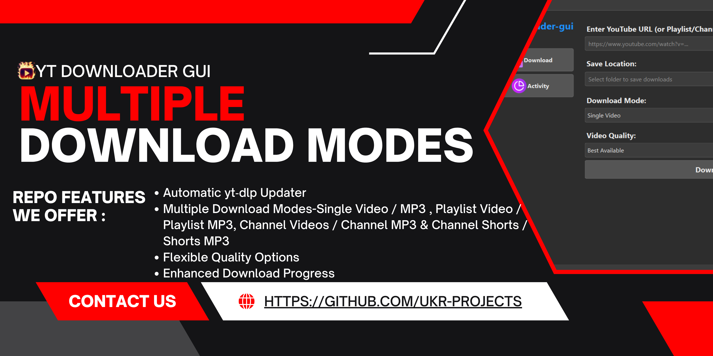
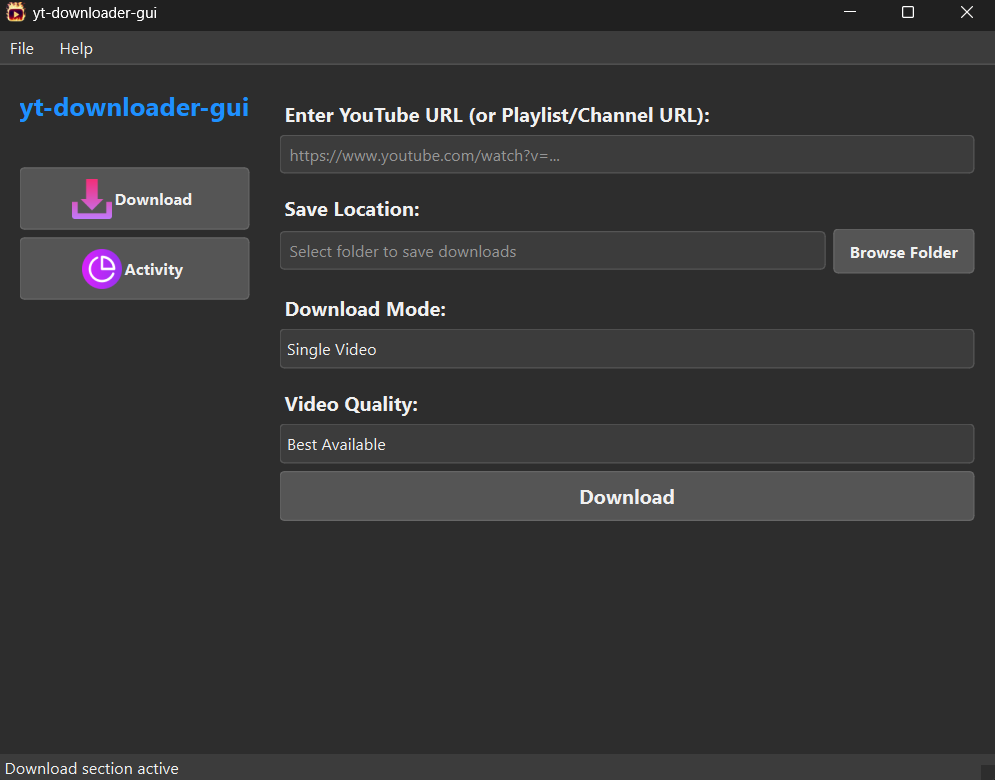

<h1>
  
  yt-downloader-gui
</h1>

[](LICENSE)
[](STATUS.md)
[](CHANGELOG.md)


<div align="center">
  
</div>

<div align="center">
  
</div>

---
## 🖼 Screenshot

<div align="center">
  
  <p><em>GUI Interface</em></p>
</div>

---
## 🆕 What’s New in v1.0.0

- **Professional UI Redesign**
  - Complete visual overhaul with a new professional dark theme.
  - Consistent styling across all widgets using a dedicated QSS stylesheet.
  - Improved layout with a larger default window size for a better user experience.
- **Enhanced Download Progress**
  - Added a visual progress bar to the "Activity" page for real-time download feedback.
  - The progress bar is updated dynamically by parsing `yt-dlp`'s output.
- **Code Refinements**
  - Removed all inline styling in favor of the new stylesheet.
  - Added object names to widgets for more specific styling.

---

## ⭐ Features

- **Automatic yt‑dlp Updater**  
  Checks GitHub for new yt-dlp releases and replaces your local binary automatically.
- **Multiple Download Modes**  
  - Single Video / MP3  
  - Playlist Video / Playlist MP3  
  - Channel Videos / Channel MP3  
  - Channel Shorts / Shorts MP3
- **Cookie‑Based Login**  
  Import YouTube cookies via “Get cookies.txt Locally” extension for authenticated downloads.
- **Modern PyQt6 GUI**  
  Intuitive sidebar, real‑time status, and scrolling activity log.
- **Flexible Quality Options**  
  Choose best‑available or specific resolutions (8K, 4K, 1080p, etc.); MP3 defaults to 320 kbps.
- **Lightweight & Cross‑Platform**  
  Single‑file app plus assets; runs on Windows, macOS, and Linux (ffmpeg required).

---

## 📁 Folder Structure

```

```

---

## 🕹 Usage

### Prerequisites

- GitHub

### Installation

```bash
# Clone the repository
git clone https://github.com/uikraft-hub/yt-downloader-gui.git
```

For more detailed documentation, see our [USAGE.md](USAGE.md)

---

## 🤝 Contributing

Please see our [Contributing Guide](CONTRIBUTING.md) for details.

---

### Code of Conduct

This project follows our [Code of Conduct](CODE_OF_CONDUCT.md). Please read it before contributing.

---

## 📋 Roadmap

- [x] Modern PyQt6 GUI
- [x] Multiple Download Modes
- [x] Automatic yt‑dlp Updater

See the [open issues](https://github.com/uikraft-hub/yt-downloader-gui/issues) for a full list of proposed features and known issues.

---

## 📝 Changelog

All notable changes to this project are documented in [CHANGELOG.md](CHANGELOG.md).

---

## 📄 License

This project is licensed under the MIT License - see the [LICENSE](../LICENSE) file for details.

---

## 🙏 Acknowledgments

* **yt-dlp** for the robust download backend
* **PyQt6** for the modern GUI framework
* **ffmpeg** for audio/video processing
* **GitHub API** for seamless updater integration

---

## 📞 Support

- 📧 Email: ujjwalkrai@gmail.com
- 🐛 Issues: [Repo Issues](https://github.com/uikraft-hub/yt-downloader-gui/issues)
- 🔓 Security: [Repo Security](https://github.com/uikraft-hub/yt-downloader-gui/security)
- ⛏ Pull Request: [Repo Pull Request](https://github.com/uikraft-hub/yt-downloader-gui/pulls)
- 📖 Docs: [Repo Documentation](https://github.com/uikraft-hub/yt-downloader-gui/tree/main/docs)
- 📃 Changelog: [Repo Changelog](https://github.com/uikraft-hub/yt-downloader-gui/docs/CHANGELOG.md)
---

## 🔗 Connect

#### 📝 Writing & Blogging
[](https://ukr-projects.hashnode.dev/)
[](https://medium.com/@ukrpurojekuto)

#### 💼 Professional
[](https://ukr-projects.github.io/ukr-projects/)
[](https://github.com/ukr-projects)
[](https://github.com/cyberx-projects)
[](https://github.com/contro-projects)
[](https://www.linkedin.com/in/u-k-r/ )
[](https://www.youtube.com/@ujjwal-krai)

#### 🌐 Social
[](https://x.com/ukr_projects)
[](https://www.instagram.com/ukr_projects)
[](https://www.youtube.com/@ukr-projects)
[](https://t.me/ukr_projects)
[](https://www.reddit.com/user/mrujjwalkr)

---

<div align="center">
  Made with ❤️ by <a href="https://github.com/ukr-projects">ukr</a>
</div>

---


